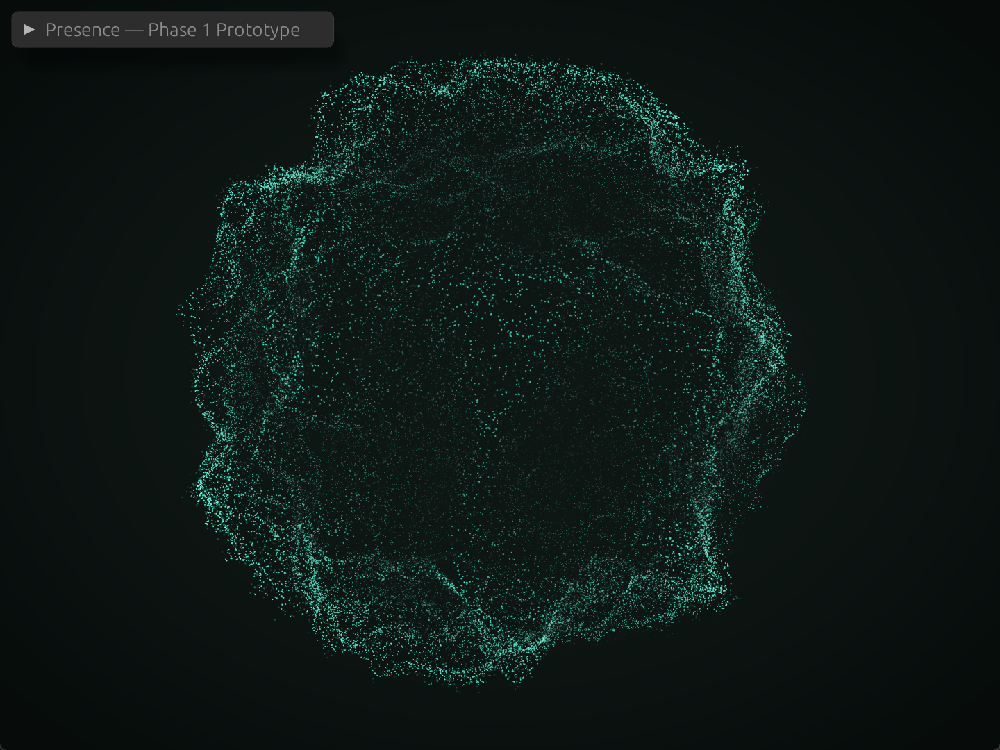
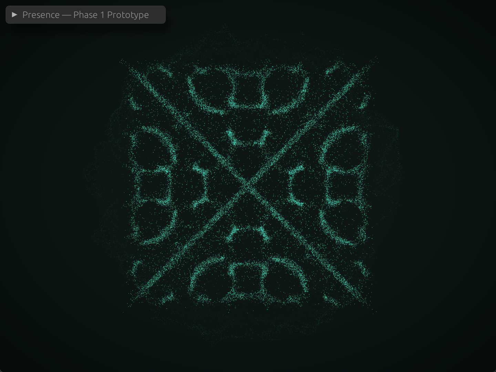
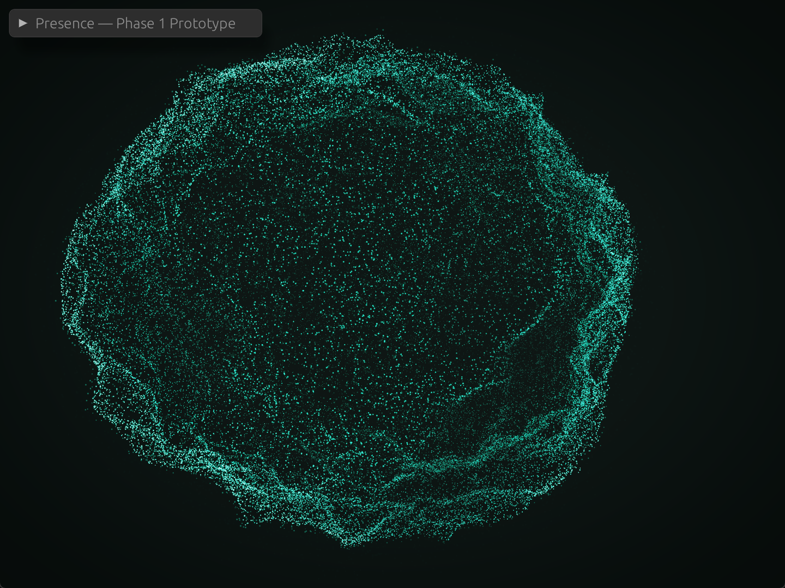
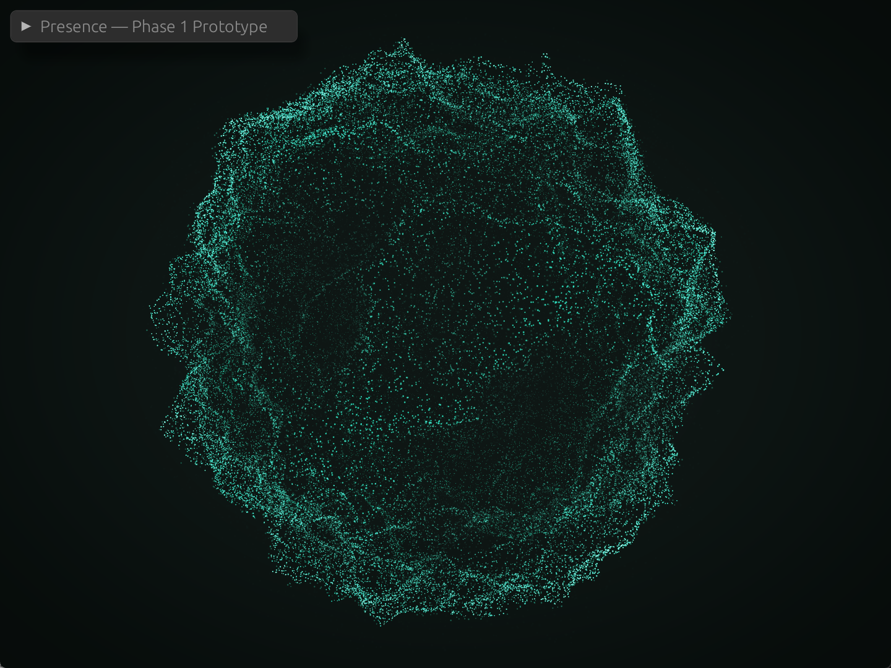
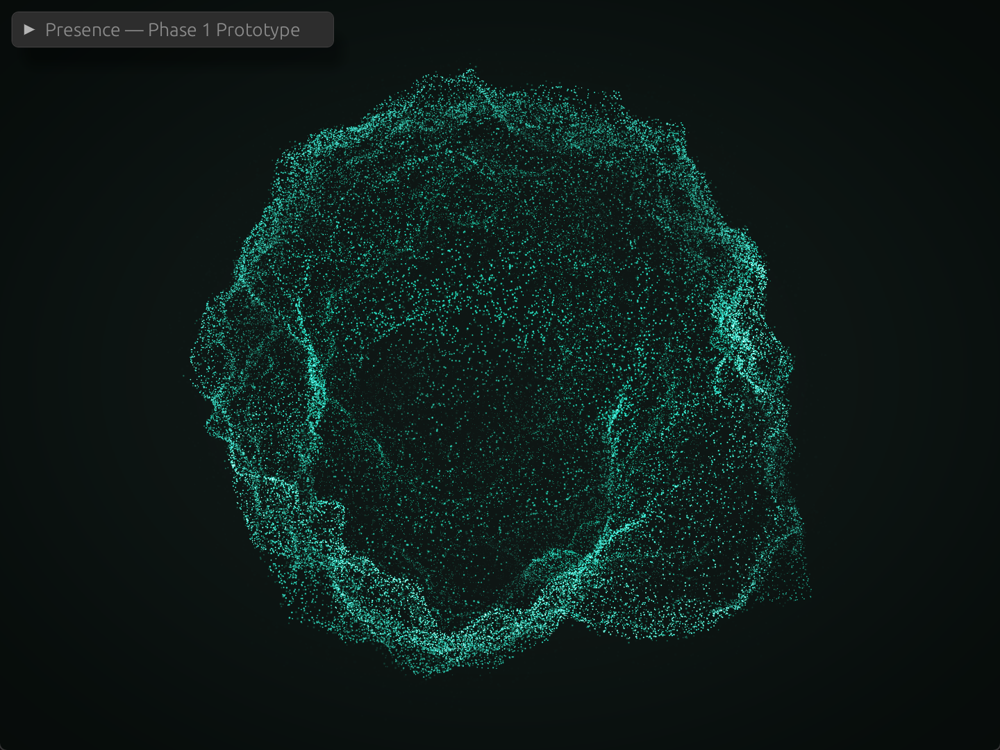
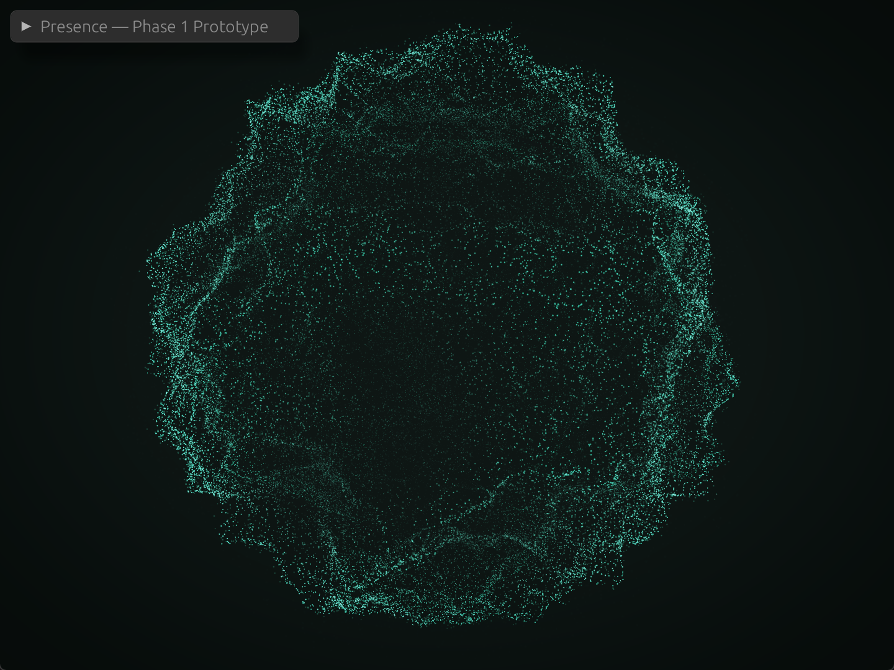
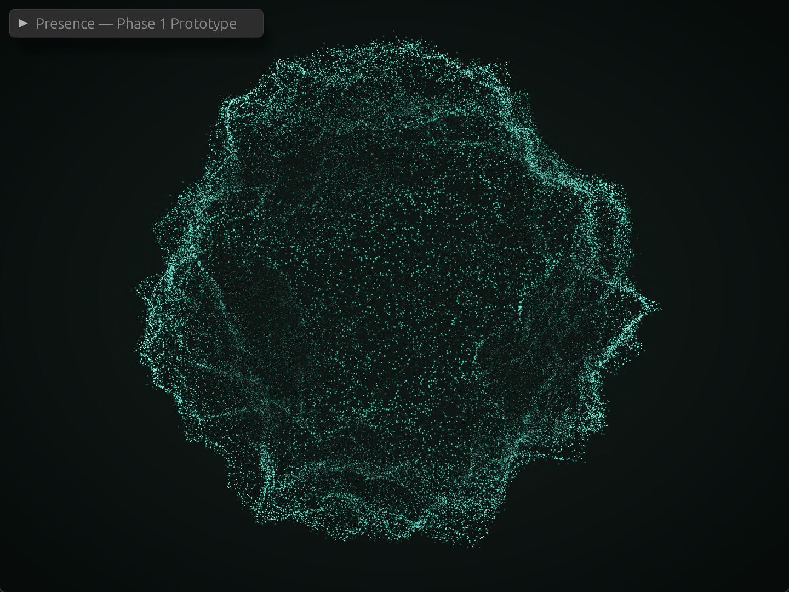
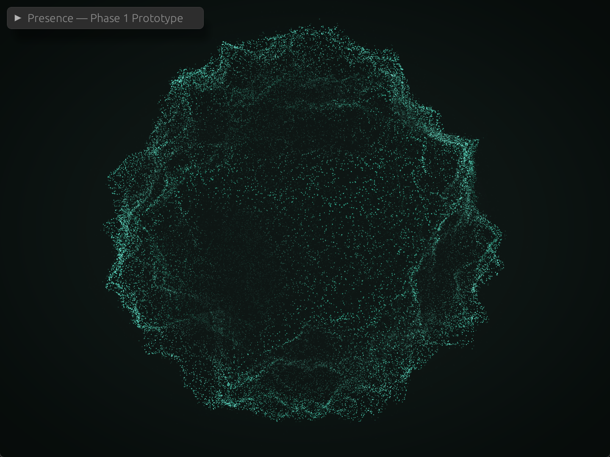

# presence-prototype

Phase 1 standalone prototype for the **Point Cloud Presence / Live System
Scanner** — see `../docs/PRESENCE_VISUAL_ENTITY.md`,
`../docs/PRESENCE_SCENES.md`, and `../docs/PRESENCE_INTEGRATION_PLAN.md` in
the main repo for the full design and rationale.

This is a **standalone Cargo project**, not a member of the main workspace
(see the root `Cargo.toml`'s `exclude` list and `../docs/HEADLESS.md`) —
it needs a GPU/window surface, so it must never be required by headless
`cargo test --workspace` / CI.

| Idle — the shell at rest | Loading — sand on a driven Chladni plate |
|---|---|
|  |  |

| `thinking` — a bulge rising | `speaking` — rings crossing the limb | `tool_use` — pendants reaching |
|---|---|---|
|  |  |  |

Those three are the same shell as the first image with one more term
weighted in, which is why the folds are still recognisably there in all of
them. Stills undersell `speaking` in particular: most of what it carries is
brightness tracking the voice from one frame to the next.

| `listening` — brighter, slightly larger | `attention` — bright pulse | `error` — dimmed and pulled in |
|---|---|---|
|  |  |  |

These three are *material* modes: they change intensity, expansion, and
colour on the same shell without raising a geometry term. Listening is the
gentlest — anything louder would read as the shell pretending to work — and
attention is deliberately the brightest state the presence ever reaches.
Error is a *negative* mode, so a denial visibly wilts whatever activity was
in progress rather than adding another colour on top of it.

## What this proves

Two composable entities, rendered with a pure Rust stack (`winit` + `wgpu`
+ `noise`, no Three.js/webview — see
`../docs/adr/adr-010-point-cloud-presence-entity.md`):

- **AssistantCloud** (always on) — one `PresenceShell` whose radius is a
  weighted sum of independent terms. At rest only the fold term is live: a
  sphere displaced by ridged noise, so it reads as a creased skin with a
  bright grazing rim and fold filaments across its face. `thinking`,
  `speaking`, and `tool_use` each raise a further term on the same shell
  rather than selecting a different shape, so they compose and their
  transitions are weight lerps
  (`../docs/adr/adr-012-additive-mode-composition.md`).
- **LoadingRing** (toggle on/off) — the Loading resonance field: a
  stationary sheet with sand on it, redrawing into a new Chladni figure
  each time the driving frequency steps to the next resonance. Composited
  alongside a *subdued* idle shell rather than replacing it.

  It does not rotate, and that is a rule rather than an oversight — a form
  turning on its own axis is a loading spinner, and a spinner looks
  identical whether work is progressing or wedged, so it carries no
  information. The figure redrawing is something a stalled system can't
  fake.

Both run the same generator and the same behavior and differ only by
shape, which is the thing actually being proven — adding a state is a
shape, not an engine change.

### Points sit on surfaces

The first version distributed points *through* sphere volumes and read as
a nebula rather than a scanned object. That is a model problem, not a
tuning one: a LiDAR return only ever comes from a surface, and a volume
has no silhouette (it is brightest at its centre, where a surface is
brightest at its grazing rim) and no creases (fold filaments are surface
curvature). `../docs/adr/adr-011-surface-point-generation-and-palette-setting.md`
has the full reasoning; the load-bearing parts of the implementation:

- A `SurfaceShape` answers "where is the skin right now". One
  `SurfaceGenerator` seeds a population across its domain and one
  `SurfaceBehavior` springs particles onto it with the same damped spring
  the volumetric behaviors used, so motion stays soft even though the
  target is now a hard surface.
- The trait splits into `frame` (once per step), `deform` (the noise —
  essentially the whole simulation cost) and `place` (rigid motion and
  breathing, nearly free). `deform` refreshes for a rotating quarter of
  the population each step, which is invisible because idle's folds
  reshape over tens of seconds, and is the difference between a budget of
  ~15k points and one of ~80k.
- The shell's fold term displaces by *ridged* noise and reuses the same
  ridge value as the crease brightness, so creases land on folds by
  construction and at zero extra cost.
- The normal is the seed direction, not a finite-differenced gradient
  (~6 extra noise evaluations per particle). For a star-shaped radial
  surface that is exact at the limb, which is precisely where the grazing
  term is read.

### Modes add terms, they don't swap shapes

`r(seed, t) = 1 + Σ wᵢ · termᵢ(seed, t)`. A mode raises a weight in
`ShellDrive`; the director lerps it. Nothing cross-fades and no population
is swapped, so two modes at once is two raised weights and needs no code of
its own. Terms below `ShellDrive::GATE` are skipped outright, which is what
keeps idle at the cost it had before any of them existed.

- **Lobes** (`thinking`) — 2–4 bulges that gather, rise, thin, and are
  reabsorbed. Centres and envelopes resolve once per frame; per particle it
  is a dot product and an exponential per lobe, with no noise evaluations.
  This replaces §6's "strong curl swirl" for thinking: curl displaces points
  *through* a volume, and these live on a skin, so curl only makes the shell
  fuzzy.
- **Pulse** (`speaking`) — a travelling wave, and the only term in `place`
  rather than `deform`, since `deform`'s 15 Hz stagger would alias it into a
  crawl.
- **Neck** (`tool_use`) — a pendant that extends, holds, and retracts, with
  a pinched waist behind the tip. It does not detach: a `SurfaceShape` is
  star-shaped about its centre, so a detached droplet is two surfaces on one
  ray and is structurally inexpressible here. Reaching out and pulling back
  maps to a call's request-and-response better than shedding does anyway,
  because it makes completion visible.

**Speech cannot move geometry at syllable rate.** `SurfaceBehavior`'s
spring sits near 0.7 Hz, so a 4–7 Hz syllable signal arrives at the skin
attenuated to roughly two percent. The state is split by what each channel
can carry: geometry follows a smoothed *phrase* envelope, and syllable-rate
response goes to `brightness`, assigned directly and never sprung so it
lands within one step. Raising the spring to chase syllables would need
roughly 70x the stiffness and would harden every other mode's motion.

### Render pipeline

The points are view-aligned billboard quads with a soft circular falloff
(`wgpu` has no portable point-size primitive), instanced in one draw call
and additively blended, so overlap accumulates into density with no depth
sorting. They render into an `Rgba16Float` target rather than straight to
the swapchain, then go through bright-pass → 5-level bloom
downsample/upsample → ACES tonemap + vignette composite.

The HDR target is what makes the whole thing work rather than being
gratuitous: point brightness is an *energy contribution*, and hundreds of
points overlap near a cluster centre. Clipping that at 1.0 in the swapchain
flattens every dense region to the same solid colour and destroys exactly
the density information the visual is made of.

Colour runs on two independent axes, which is easy to conflate and worth
keeping straight (`../docs/PRESENCE_VISUAL_ENTITY.md` §3.1/§3.2):

- **State** — calm sits at the palette's near-neutral stop with a faint
  signature-hue undertone; heavy compute shifts cooler toward its deepest
  stop.
- **Density** — accumulated highlights desaturate toward white, so §3.1's
  "near-white hotspots at the densest points" emerge from real density
  instead of being painted on. This has to happen *after* accumulation:
  additive blending of a teal tint only ever yields a more saturated teal,
  which a tonemap clips to vivid green.

The stops themselves come from a selectable `PaletteId` — `teal`
(default), `lime`, `ice`, `ember` — not from constants baked into the
shader. Colour is a user setting, because the presence is the assistant's
visual character and which hue it wears is the operator's call
(ADR-011). Every stop is stored as pure chroma: points are emissive, so
lightness has to come from the energy term alone, and a dark stop used
as-is would dim every point that touched it.

Two material terms come from the surface model. **Grazing** lifts
brightness as a point's normal turns away from the view direction, which
is what draws the silhouette and makes the form read as solid.
**Crease** lifts brightness and pulls tint toward the palette's `accent`,
drawing the fold filaments. Only points actually on the skin report a
crease — the layers floating off it report none, or the filaments smear
into a glow.

Deliberately absent: no MSAA (the points' visible edge is an alpha gradient,
not geometry, so it would multiply the cost of the heaviest pass and change
almost nothing — sub-pixel shimmer is fixed where it originates, by clamping
minimum screen-space point radius and compensating brightness), and no depth
buffer (additive blending is order-independent and there is no opaque
geometry, so it would be written and never read).

### Performance

**80,000 points** in the shell (and 40,000 more in the loading plate when
it is showing) at 2560×1600 with the full bloom chain, in a release build
on a **2-core** machine:

| State | FPS |
|---|---|
| idle | ~150–178 |
| `thinking` | ~137–162 |
| `speaking` | ~109–121 |
| `tool_use` | ~124–152 |
| `thinking` + `tool_use` | ~146–171 |

A comfortable margin over 60 FPS everywhere, and no need for a GPU compute
path at this stage. That is roughly 7x the count the design documents
originally suggested; see ADR-011 for why a surface needs it and
`../docs/PRESENCE_VISUAL_ENTITY.md` §9 for the revised budget guidance.

Two things in that table are worth knowing before optimizing the wrong
thing. `speaking` is the *most* expensive state despite being the smallest
term, because the pulse lives in `place` and so runs at the full step rate
while every other term runs on `deform`'s quarter-rate stagger — a term's
cost is set by which half of the trait it sits in, not by its complexity.
And two modes at once costs about what one does, because gating means the
per-particle work is proportional to the number of *live* terms rather than
to how much is happening.

The cost is CPU-side noise evaluation, not the draw. Four things bought
the headroom, in rough order of how much they mattered:

- **Staggering the deform refresh.** Each particle re-evaluates its shape's
  noise every 4th step rather than every step. The folds it describes
  reshape over tens of seconds, so 15 Hz is far above what the motion can
  resolve. Refreshing in strided slices rather than contiguous blocks
  matters: generation walks the surface in seed order, so a block would
  update one spatial region at a time, and a region snapping while its
  neighbours lag is visible in a way a scatter of individual particles is
  not.
- **Dropping per-particle wander noise.** The volumetric behavior needed it
  because its points had nothing else to do. A surface is already
  breathing, turning, and reshaping under them, so wander cost as much as
  the entire shape evaluation while only blurring the silhouette.
- Release/dev profiles in `Cargo.toml`. The hot path is `noise`'s 4-D
  Simplex, i.e. dependency code, so `[profile.dev.package."*"] opt-level = 3`
  makes `cargo run` usable for visual iteration without giving up
  debuggability of this crate's own frames.
- A fixed-timestep accumulator, so the spring integrators behave identically
  at 30 Hz and 144 Hz. Note this *amplifies* per-step simulation cost when
  frames run long — several steps per frame — so it makes an expensive
  simulation feel disproportionately worse, and it is worth remembering
  when a change to `deform` tanks the frame rate.

If a slower machine cannot hold this, the fallbacks in order are: drop the
shell to 2 octaves, then widen the refresh stride, then `rayon`. GPU
compute comes after all three.

## Run it

Prefer `--release` when judging how it looks — the simulation is CPU-bound
and a debug build of this crate's own code is noticeably choppier.


If a plain `cargo run` fails to link with `LINK : fatal error LNK1104:
cannot open file 'msvcrt.lib'` (a Visual Studio Build Tools env/PATH
issue on this machine, not a code problem — the default shell doesn't
have `LIB`/`INCLUDE` set), use the helper script from the repo root,
which loads the MSVC dev environment first, the same way
`scripts\tauri-dev.cmd` does for `desktop-edge`:

```bat
scripts\presence-dev.cmd run --release
```

Or, if your shell already has a working MSVC environment (e.g. a
Developer Command Prompt):

```bash
cd presence-prototype
cargo run --release
```

First build will take a while (wgpu/egui have a large dependency tree), and
the release profile uses `lto = true` with `codegen-units = 1`, so its link
step alone runs for a couple of minutes.

`set RUST_LOG=info` for adapter/backend selection logs, and
`set PRESENCE_LOG_FPS=1` to log the smoothed frame rate periodically when
the debug panel is collapsed.

`set PRESENCE_DROPLET=1` before launching to swap the standard 960×720
resizable window for a **frameless, always-on-top 320×320 droplet** —
the shape ADR-013 commits to for the shipping product. Per-pixel
transparency (composite-shader alpha output) is a separate follow-up; in
this pass the droplet is a small opaque always-on-top square, and the
point of the flag is to exercise the chrome and z-order path before the
alpha path is wired up.

## Driving the presence from another process (stdin transport)

`presence-runtime` can accept a live stream of commands from stdin, so a
shell (Tauri edge, a test harness, or a hand-fed PowerShell here-string)
can drive the presence without touching the debug panel. Off by default —
the debug harness needs stdin free for the terminal — set the opt-in and
the runtime spawns a reader thread:

```powershell
$env:PRESENCE_STDIN_IPC = "1"
scripts\presence-dev.cmd run --release
```

Then, from another process, write newline-delimited
[`presence_ipc::Envelope`](../crates/presence-ipc/src/lib.rs) payloads to
that runtime's stdin. One envelope per line:

```json
{"version":1,"payload":{"kind":"set_signals","intensity":0.7,"audio_level":0.35,"progress":0.0,"active_modes":["thinking"]}}
{"version":1,"payload":{"kind":"set_mode","mode":"speaking","engaged":true}}
{"version":1,"payload":{"kind":"set_palette","palette":"ember"}}
```

Semantics live in `presence-core`'s `SceneDirector::apply_command`
(behind the `ipc` feature): `set_signals` treats `active_modes` as
authoritative (modes not in the list are released), `set_mode` is a
plain toggle. Envelopes whose `version` does not match this build's
`presence_ipc::VERSION` are logged and dropped rather than executed.

The reverse direction (presence → shell) is a Phase 4 concern —
docs/PRESENCE_INTEGRATION_PLAN.md and ADR-013 for the design.

## Controls

- **L** or the checkbox in the debug panel — toggle the `LoadingRing` entity.
- **T** / **S** / **U** — toggle `thinking` / `speaking` / `tool_use`. They
  are toggles rather than a selection because the modes are additive and the
  overlaps are the part worth looking at; a radio group would hide the
  model's central claim. The panel shows the resolved term weights beneath
  them.
- **N** / **A** / **E** — toggle `listening` / `attention` / `error`. These
  are *material* modes: they change brightness, expansion, and colour on the
  shell without raising a shell term, so `Mode` reads e.g. `thinking +
  listening` but `drive` stays at `lobes 1.00 · pulse 0.00 · neck 0.00`. A
  material mode raising a term would be exactly the failure `§5.1` rules
  out — the shell reshaping itself to hear rather than to think.
- **Esc** — quit.
- Debug panel (top-left, `egui`): active entity/point counts, presence
  (fade) values, a palette selector, and sliders for `intensity` /
  `audio_level` / `progress` — the same `PresenceSignals` shape real
  assistant state will drive later (`docs/PRESENCE_SCENES.md` §7). There's
  no real assistant signal wired up yet; this is exactly the point of a
  Phase 1 prototype. The palette selector is the one control here that
  isn't development-only: it's a real user setting
  (`EdgeSettings.presence_palette` in Phase 2) being exercised early.
- `set PRESENCE_PALETTE=lime` to pick the starting palette without touching
  the panel — useful for scripted captures.
- Debug panel is **collapsed on open** and narrow on purpose: the point of
  the prototype is judging how the entity looks, and a panel covering a
  third of the window makes that impossible.

## Screenshots

`capture.ps1` grabs a running prototype's client area:

```bat
powershell -ExecutionPolicy Bypass -File capture.ps1 -Out shot.png
```

`shot.ps1` wraps it into one command — rebuild, run, settle, optionally
send dev keys, capture, and report the frame rate:

```bat
powershell -ExecutionPolicy Bypass -File shot.ps1 -Settle 16 -Keys "l" -Out loading.png
```

`-Keys` exists because the states worth looking at sit behind the dev keys
and a script has no other way to reach them.

Two things about `capture.ps1` are load-bearing rather than incidental.

It declares per-monitor DPI awareness before touching any screen geometry.
In a DPI-unaware process on a scaled display, `VirtualScreen` reports
logical pixels while `CopyFromScreen` copies physical ones, so the capture
silently becomes a magnified crop of the desktop's top-left corner. That
artifact reads as the entity being off-centre and drifting, and it cost a
real debugging detour chasing a projection bug that did not exist.

It also captures the window's **client rectangle**, translated to screen
coordinates, rather than maximizing and grabbing the whole screen. Driving
the window's state from the capture script turned out to be unreliable in
its own right, and it changed what was being measured. Framing from the
client rect is correct at whatever size the window happens to be.

If a capture ever looks off-centre again, verify against the window itself
before touching the camera.

## What's deliberately *not* here

Per `docs/PRESENCE_INTEGRATION_PLAN.md` §4's Phase 1 scope: no
`listening`/`error`/`attention` modes, no window
transparency/always-on-top behavior, no connection to `desktop-edge` or
any real assistant-core signal. Those are Phase 2/3.

The three absent modes need no geometry — they are colour, brightness, and
framing changes — so they will sit on the weight/lerp machinery in
`src/scene/mode.rs` without adding shell terms. Droplet detachment (a
`DataStream` entity) is also out; see ADR-012.

## Code map

This directory is a small Cargo workspace with two crates (Phase 2 §1 of
`../docs/PRESENCE_INTEGRATION_PLAN.md` — the split that lets the library
be reused by `desktop-edge` without dragging the dev harness along):

- **`presence-core/`** — library. Simulation, scene director, and renderer.
  No window creation, no key handling, no debug overlay. This is the crate
  the shell integration in Phase 2 will depend on.
  - `src/sim/` — the `PointGenerator`/`PointBehavior` traits, the
    Simplex/ridged/curl noise field (`../docs/PRESENCE_VISUAL_ENTITY.md` §6),
    and `shapes.rs`: the `SurfaceShape` trait plus `PresenceShell` (every
    mode) and `ResonancePlate` (Loading), the shared `SurfaceGenerator`,
    and `SurfaceBehavior`. `shapes.rs` is where the interesting reasoning
    lives.
  - `src/scene/` — `EntityInstance`, `SceneDirector` (transition
    orchestration), `mode.rs` (`PresenceMode` and the eased weight ramps
    that drive the shell's terms), `SceneRegistry` (the "clear registration
    point" for future scenes, `../docs/PRESENCE_SCENES.md` §9 item 5).
  - `src/render/` — `wgpu` setup, the instanced-billboard point pipeline
    (`../docs/PRESENCE_VISUAL_ENTITY.md` §7.4), the camera and its
    `PointMaterial` tunables, and `post.rs` — the HDR target, bloom chain,
    and tonemap composite.
  - `src/palette.rs` — `PaletteId`/`PresencePalette`: the selectable colour
    schemes. The teal preset's hexes are pulled from
    `../desktop-edge/src/App.css`'s custom properties so the prototype and
    the shipped UI never drift into two different "teal"s (see
    `../docs/PRESENCE_VISUAL_ENTITY.md` §3.1).
- **`presence-runtime/`** — binary. Hosts `presence-core` inside a `winit`
  event loop and adds the `egui` debug panel.
  - `src/main.rs` — event loop entry.
  - `src/app.rs` — `winit` `ApplicationHandler`, fixed-timestep simulation
    driver, adaptive quality downshift.
  - `src/ui.rs` — `egui` debug overlay/dev controls. A follow-up will
    move this behind a `dev` Cargo feature so a shipping build strips the
    overlay entirely (see Phase 2 §1).
